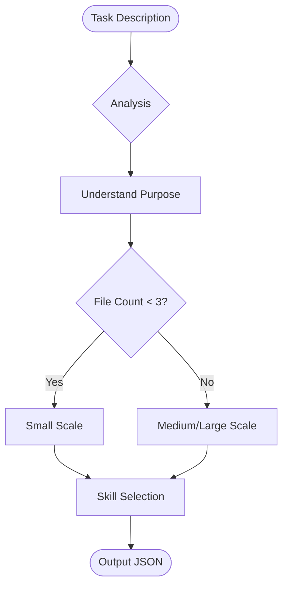

# Task Analyzer

> ⚠️ **CONSTITUTION**: You must strictly follow the [Workflow Constitution](../../rules/00_constitution.md). This is the supreme law. Violation is not permitted.

Provides metacognitive task analysis and skill selection guidance.

## Skills Index

See **[skills-index.yaml](references/skills-index.yaml)** for available skills metadata.

## Decision Logic


## Task Analysis Process

### 1. Understand Task Essence
**Goal**: Identify fundamental purpose beyond surface work.
**Directives**:
1.  **Look Deeper**: "Fix bug" -> "Root Cause Analysis".
2.  **Ask**: What are we *really* solving?

### 2. Estimate Task Scale
**Constraint**: Use File Count as primary metric.
-   **Small**: 1-2 files.
-   **Medium**: 3-5 files.
-   **Large**: 6+ files.

### 3. Identify Task Type
**Match**:
-   **Implementation**: New code -> `coding-principles`.
-   **Fix**: Bug resolution -> `ai-development-guide`.
-   **Refactoring**: Structure -> `coding-principles`.
-   **Design**: Architecture -> `technical-designer`.
-   **Quality**: Testing -> `testing-principles`.

### 4. Tag-Based Skill Matching

Extract relevant tags from task description and match against skills-index.yaml:

```yaml
Task: "Implement user authentication with tests"
Extracted tags: [implementation, testing, security]
Matched skills:
  - coding-principles (implementation, security)
  - testing-principles (testing)
  - ai-development-guide (implementation)
```

### 5. Implicit Relationships

Consider hidden dependencies:

| Task Involves | Also Include |
|---------------|--------------|
| Error handling | debugging, testing |
| New features | design, implementation, documentation |
| Performance | profiling, optimization, testing |
| Frontend | typescript-rules, typescript-testing |
| API/Integration | integration-e2e-testing |

## Output Format

Return structured analysis with skill metadata from skills-index.yaml:

```yaml
taskAnalysis:
  essence: <string>  # Fundamental purpose identified
  type: <implementation|fix|refactoring|design|quality>
  scale: <small|medium|large>
  estimatedFiles: <number>
  tags: [<string>, ...]  # Extracted from task description

selectedSkills:
  - skill: <skill-name>  # From skills-index.yaml
    priority: <high|medium|low>
    reason: <string>  # Why this skill was selected
    # Pass through metadata from skills-index.yaml
    tags: [...]
    typical-use: <string>
    size: <small|medium|large>
    sections: [...]  # All sections from yaml, unfiltered
```

**Note**: Section selection (choosing which sections are relevant) is done after reading the actual SKILL.md files.

## Skill Selection Priority

1. **Essential** - Directly related to task type
2. **Quality** - Testing and quality assurance
3. **Process** - Workflow and documentation
4. **Supplementary** - Reference and best practices

## Metacognitive Question Design

Generate 3-5 questions according to task nature:

| Task Type | Question Focus |
|-----------|----------------|
| Implementation | Design validity, edge cases, performance |
| Fix | Root cause (5 Whys), impact scope, regression testing |
| Refactoring | Current problems, target state, phased plan |
| Design | Requirement clarity, future extensibility, trade-offs |

## Warning Patterns

Detect and flag these patterns:

| Pattern | Warning | Mitigation |
|---------|---------|------------|
| Large change at once | High risk | Split into phases |
| Implementation without tests | Quality risk | Follow TDD |
| Immediate fix on error | Root cause missed | Pause, analyze |
| Coding without plan | Scope creep | Plan first |