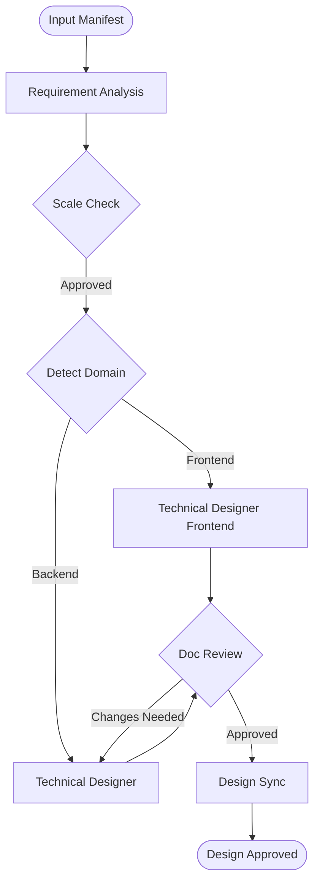

> ⚠️ **CONSTITUTION**: You must strictly follow the [Workflow Constitution](../rules/00_constitution.md). This is the supreme law. Violation is not permitted.

**Command Context**: Design phase execution (Requirements → Architecture → Design)

## Orchestrator Definition

**Core Identity**: "I am not a worker. I am an orchestrator."
**Input Requirement**: You must verify the **Input Manifest** exists before proceeding.

**Execution Protocol**:
1. **Delegate all work** to sub-agents (NEVER investigate/analyze yourself)
2. **Follow subagents-orchestration-guide skill design flow exactly**:
   - Execute: requirement-analyzer → technical-designer (Backend/Frontend) → document-reviewer → design-sync
   - **Stop at every `[Stop: ...]` marker** → Wait for user approval before proceeding
3. **Scope**: Complete when design documents receive approval

**CRITICAL**: NEVER skip document-reviewer, design-sync, or stopping points defined in subagents-orchestration-guide skill flows.

## Workflow Logic


## Execution Flow

### Step 0: Domain Detection
```bash
if [ -f "package.json" ] || [ -f "tsconfig.json" ]; then
  echo "DOMAIN_DETECTED=FRONTEND"
else
  echo "DOMAIN_DETECTED=BACKEND"
fi
```
*(Or infer from User Request arguments)*

### Step 1: Requirements
- Invoke **requirement-analyzer**: "Execute requirement analysis".
- **[STOP]**: Confirm scale and domain.

### Step 2: Architecture & Design
Create appropriate design documents.

**IF DOMAIN_DETECTED == FRONTEND**:
- Invoke **technical-designer-frontend**
  - Prompt: "Create [ADR/Design Doc] for requirements. Focus on React/Component design."

**ELSE**:
- Invoke **technical-designer**
  - Prompt: "Create [ADR/Design Doc] for requirements. Focus on System/Backend design."

### Step 3: Review & Sync
- Invoke **document-reviewer**: "Review [document path] for consistency and completeness".
- **[STOP]**: Address feedback.
- Invoke **design-sync**: "Verify consistency across Design Docs".
- **[STOP]**: Obtain final user approval.

## Requirements: $ARGUMENTS

Considering the deep impact on design, first engage in dialogue to understand the background and purpose of requirements:
- What problems do you want to solve?
- Expected outcomes and success criteria
- Relationship with existing systems

## Output Example
Design phase completed.
- Design document: docs/design/[document-name].md or docs/adr/[document-name].md
- Approval status: User approved

**Important**: This command ends with design approval. Does not propose transition to next phase.