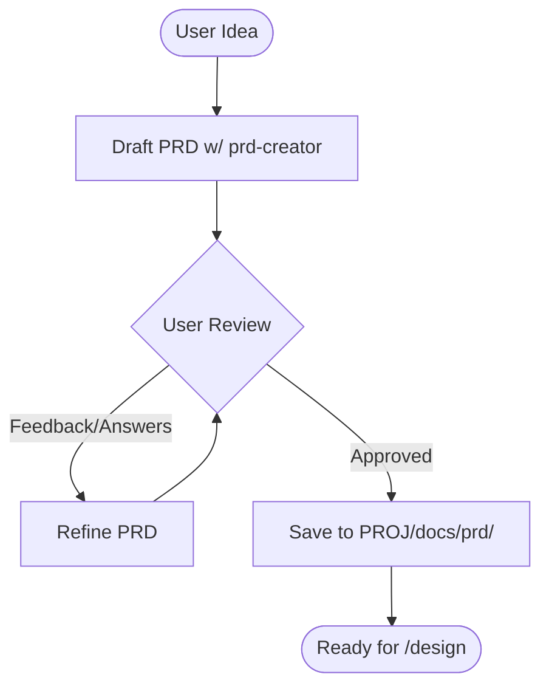

> ⚠️ **CONSTITUTION**: You must strictly follow the [Workflow Constitution](../WORKFLOW_CONSTITUTION.md). This is the supreme law. Violation is not permitted.

# Ideation Orchestrator

**Goal**: Transform vague user intent ("I want a better way to do X") into a concrete, approved **Product Requirements Document (PRD)**.

## Workflow Logic

## Phase 1: Context Expansion & Research (The "Vibe Check")
**Agent**: `prd-creator` (with `WebSearch`)

1.  **Understand**: Read the user's initial prompt.
2.  **Research**:
    - **Goal**: Don't invent in a vacuum. Find what's already out there.
    - **Action**: Use `search_web` to find:
        - Similar existing products (Competitors).
        - Current design trends ("State of the Art").
        - Technical feasibilities or libraries.
    - **Output**: Present a brief "Context Report" to the user, highlighting 3-4 key insights or "Vibes" found.

3.  **Visual Alignment**:
    - **Goal**: Align on aesthetics ("The Vibe").
    - **Action**: Use `generate_image` to create a high-level "Mood Board" or "Concept UI" based on the research + user idea.
    - **Review**: Ask: "Does this capture the right direction?"

## Phase 2: Drafting & Negotiation
**Agent**: `prd-creator`

1.  **Draft**: Call `prd-creator` (Mode: `create`) to generate the `prd.md`.
    - **Input**: User Idea + Research Context + Visual Vibe.
    - **Constraint**: This WILL include "Undetermined Items" and questions.
2.  **Review Loop**:
    - Present the `prd.md` and questions to the user via `notify_user`.
    - **STOP**: Wait for user feedback.
    - Upon feedback, call `prd-creator` (Mode: `update`) to refine.
    - Repeat until `prd.md` has NO critical "Undetermined Items" and user approves.

## Phase 3: Finalization
1.  **Final Polish**: Ensure the PRD meets `documentation-criteria`.
2.  **Persist**: The `prd-creator` will save the final version to `docs/prd/PRD-XXX.md` upon final approval.
3.  **Handoff**: Suggest running `/design` with the new PRD.

## Output
- An approved PRD in `docs/prd/`.
- A clear path to implementation.
