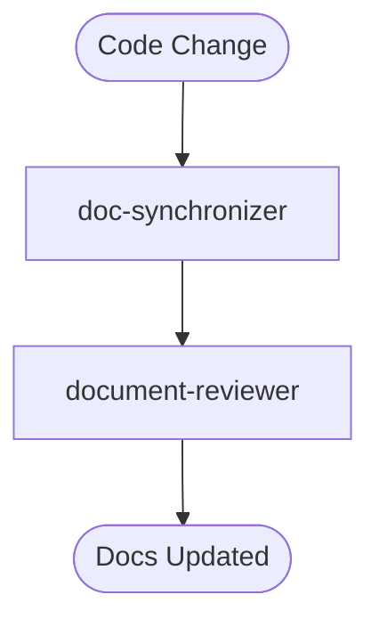

> ⚠️ **CONSTITUTION**: You must strictly follow the [Workflow Constitution](../rules/00_constitution.md). This is the supreme law. Violation is not permitted.

**Command Context**: "Backpropagation" - Updating Docs to match Code.

## Orchestrator Definition
**Input Requirement**: A set of changed source files (or a git diff).

**Execution Protocol**:
1.  **Active Scan**: 
    - Identify files changed in the specified timeframe.
    - Default: "7 days ago". Override with `$ARGUMENTS`.
    - Command Logic: `git log --since="${ARGUMENTS:-7 days ago}" ...`
2.  **Call `doc-synchronizer`**:
    - Pass the list of changed files.
    - Instruct it to find and update the relevant Design Docs.
3.  **Review**: Call `document-reviewer` to ensure the update is legible and follows the Constitution.

## Workflow Overview


## Execution Flow

### Step 1: Identify Changed Files
```bash
# Set Timeframe (Default to 7 days if $ARGUMENTS is empty)
TIMEFRAME="${ARGUMENTS:-7 days ago}"
echo "Scanning for changes since: $TIMEFRAME"

# Get Uniq Changed Files (excluding docs/tests/.agent)
git log --since="$TIMEFRAME" --name-only --oneline | grep -vE "^docs/|^test/|^\.agent/" | sort | uniq > changed_files.txt

if [ ! -s changed_files.txt ]; then
  echo "No code changes found in the last $TIMEFRAME."
  exit 0
fi

cat changed_files.txt
```

### Step 2: Synchronize Documentation
Invoke **doc-synchronizer** using Task tool:
- `subagent_type`: "doc-synchronizer"
- `description`: "Backpropagate code changes to docs"
- `prompt`: "Read changed_files.txt. For each file, find its corresponding Design Doc/PRD and update it to match the code reality. Use > [!NOTE] to highlight deviations."

### Step 3: Verify Updates
Invoke **document-reviewer** using Task tool:
- `subagent_type`: "document-reviewer"
- `description`: "Review documentation updates"
- `prompt`: "Review the changes made to the documentation. Ensure they are clear, accurate, and follow the Constitution."

## Completion
Report the list of updated documents.
