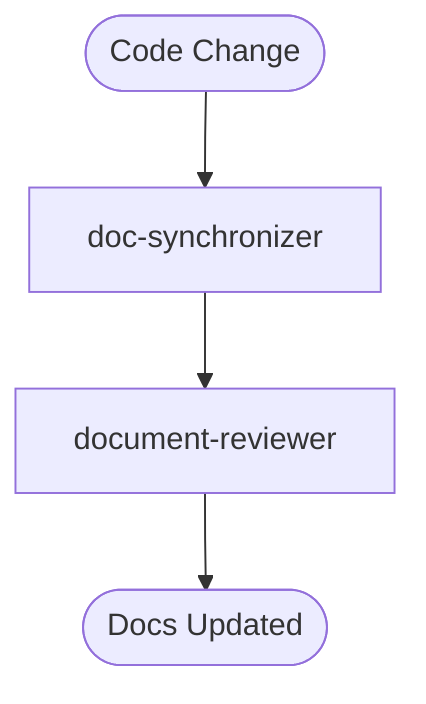

name: reconcile

> ⚠️ **CONSTITUTION**: You must strictly follow the [Workflow Constitution](../rules/00_constitution.md). This is the supreme law. Violation is not permitted.

**Command Context**: "Backpropagation" - Updating Docs to match Code.

## Orchestrator Definition
**Input Requirement**: A set of changed source files (or a git diff).

**Execution Protocol**:
1.  **Active Scan**: 
    - Identify files changed in the last 7 days (exclude `docs/`, `tests/`, `.agent/`).
    - Command: `git log --since="7 days ago" --name-only --oneline | grep -vE "^docs/|^test/|^\.agent/" | sort | uniq`
2.  **Call `doc-synchronizer`**:
    - Pass the list of changed files.
    - Instruct it to find and update the relevant Design Docs.
3.  **Review**: Call `document-reviewer` to ensure the update is legible and follows the Constitution.

## Workflow Overview

