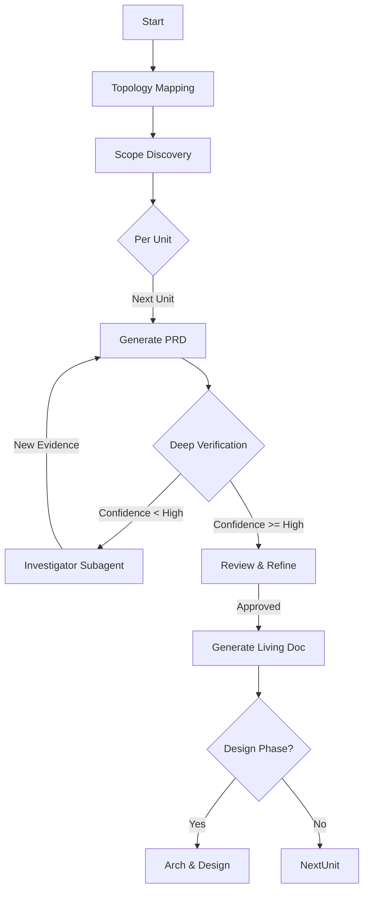

**Command Context**: Reverse engineering workflow to create living documentation from codebase topology.

Target: $ARGUMENTS

**TodoWrite**: Register phases first, then steps within each phase as you enter it.

## Step 0: Initial Configuration & Topology Mapping

### 0.1 Scope Confirmation
Use AskUserQuestion to confirm:
1.  **Target path**: Root directory or specific module
2.  **Output depth**: Living PRD only, or PRD + Architecture + Component Design
3.  **Operation Mode**: Autonomous (auto-corrects low confidence) or Interactive

### 0.2 Repository Topology Mapping (Critical)

**Task invocation**:
```
subagent_type: scope-discoverer
prompt: |
  Perform Repository Topology Analysis.
  target_path: $USER_TARGET_PATH
  visualize: true (mermaid)
```

**Store output as**: `$TOPOLOGY_MAP`

## Workflow Overview (Self-Correcting)



## Phase 1: High-Confidence PRD Generation

### Step 1: Unit Discovery
Use `$TOPOLOGY_MAP` to intelligently segment the codebase into "Value Units".

### Step 2-5: Adaptive Generation Loop

#### Step 2: PRD Generation (Draft)
Generate draft using `prd-creator`.
**Constraint**: Use "Confidence Gating" (Verify/Infer/Unknown).

#### Step 3: Deep Logic Verification
**Task invocation**: 
```
subagent_type: code-verifier
prompt: |
  Perform Deep Execution Tracing.
  document: $STEP_2_OUTPUT
  trace_depth: logical_flow
```
**Store output**: `$VERIFICATION_RESULT`

#### Step 3.5: Investigator Loop (Self-Correction)
**Condition**: If `consistencyScore` < 85 OR critical "Unverified" claims exist:
1.  Spawn `investigator` skill.
2.  Task: "Trace the execution path for [Unverified Claim]. Provide file:line evidence."
3.  Feed new evidence back to `prd-creator` for Revision 2.

#### Step 4: Traceability Injection
Inject permalinks and Mermaid diagrams into the verified PRD.
**Format**: `[Claim](file://path/to/code#L10-20)`

## Phase 2: Design & Architecture (If Requested)

### Step 6: Architecture Recovery
Use `solution-architect` to generate a System Architecture Document from the code.
**Mandatory**:
-   Component Diagram (Mermaid)
-   Data Flow Diagram (Mermaid)

### Step 7-10: Component Design
For each major component identified in Topology:
1.  **Generate Design Doc**: Use `technical-designer`.
2.  **Traceability**: Link every interface definition to source code.
3.  **Verification**: Ensure strict alignment with the generated PRD.

## Final Report: Living Documentation
Generate a `README_LIVING.md` index file:
-   Link to the Topology Map
-   Table of generated documents with "Freshness" timestamp
-   List of "Open Questions" (Low confidence areas that AI could not resolve)
