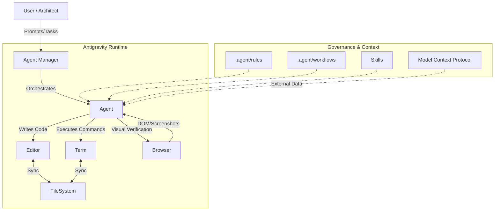
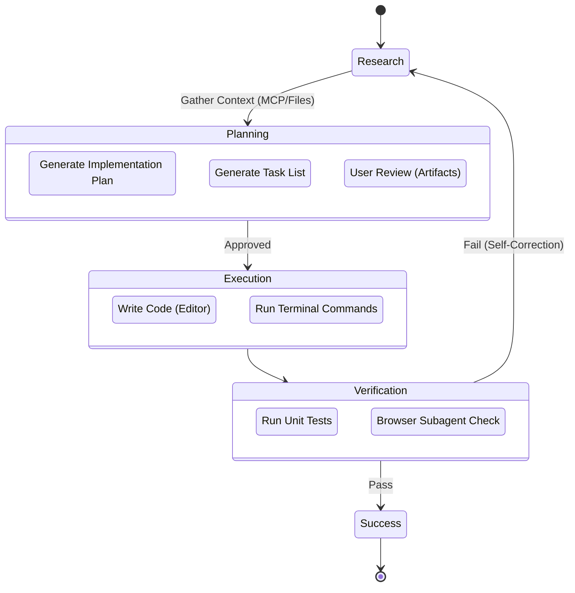

# Google Antigravity: Comprehensive System Architecture & Topology

**Meta-Information**

* **Scope:** Global Architecture, Resource Mapping, and Operational Logic
* **Collection Date:** 2026-02-03
* **Verification:** Active Filesystem Inspection & Web Research

---

## 1. System Overview

**Google Antigravity** is an **Agent-First IDE** (Integrated Development Environment) built on a forked VS Code foundation. It replaces the traditional file-centric interaction model with a task-centric **Agent Manager**, shifting the developer's role from syntax construction to system orchestration.

### 1.1 The Agent-First Paradigm

The system fundamentally alters the unit of work and interaction model:

| Feature | Copilot Era (Legacy) | Antigravity Era (Agent-First) |
| --- | --- | --- |
| **Unit of Work** | File / Function | Task / Feature |
| **Interaction** | Synchronous (Autocomplete) | Asynchronous (Background Agents) |
| **Context** | Open Files | Workspace + Knowledge Base + MCP |
| **Verification** | User Manual Test | **Agent Autonomous Verification** (Browser/Terminal) |
| **Concurrency** | Serial (One thread) | **Parallel** (Optimistic Locking) |

### 1.2 Core Components & Model Stack

The system comprises three synchronized surfaces controlled by the **Agent Runtime**: the Editor, the Terminal, and the Browser.

**Model Stack:**

* **Reasoning/Planning:** Gemini 3 Deep Think (High-compute, long-horizon planning).
* **Visual Generation:** Nano Banana (Gemini 2.5 Image) for UI mockups.
* **Browser Actuation:** Gemini 2.5 Pro UI Checkpoint (Click, scroll, type, DOM interaction).
* **Fast Context:** Gemini 2.5 Flash (Context summarization, checkpointing).

---

## 2. Resource Hierarchy & Governance

Antigravity operates on a **Cascading Priority Model**. Resources defined at the *Workspace* level always override *Global* definitions. This hierarchy manages the three main governance structures: Rules, Workflows, and Skills.

### 2.1 Rules (The Constitution)

**Definition:** Passive, "always-on" guardrails that constrain agent behavior (e.g., "Always use TypeScript strict mode").

* **Format:** Markdown files (max 12,000 chars).
* **Trigger:** Always active or manually triggered via `@mention`.

| Scope | Canonical Path | Description |
| --- | --- | --- |
| **Global** | `~/.gemini/GEMINI.md` | **Critical.** System Prompt Injection defining base personality and ethical boundaries. |
| **Workspace** | `<project>/.agent/rules/` | Project-specific constraints. |

### 2.2 Workflows (Standard Operating Procedures)

**Definition:** Active, user-triggered macros for standard procedures (e.g., `/test`, `/deploy`).

| Scope | Canonical Path | Notes |
| --- | --- | --- |
| **Global** | `~/.gemini/antigravity/global_workflows/` | Universal commands available in any context. |
| **Workspace** | `<project>/.agent/workflows/` | Project-specific logic. **Overrides Global**. |

* **Creation Pattern:** Create a markdown file with steps (e.g., "1. Run tests. 2. If fail, fix.") and define metadata in YAML frontmatter.

### 2.3 Skills (Capabilities & Personas)

**Definition:** Tool-use definitions and specialized personas.

* **Routing:** Dynamic loading based on prompt matching against the YAML `description`.

| Scope | Canonical Path | Notes |
| --- | --- | --- |
| **Global** | `~/.gemini/antigravity/global_skills/` | Universal expert personas/functions. |
| **Workspace** | `<project>/.agent/skills/` | Project-specific personas. **Overrides Global**. |
| *Legacy* | `~/.gemini/antigravity/skills/` | Deprioritized path found in older docs. |

* **Creation Pattern:** Create `<skill_name>/SKILL.md`, define the persona, and trigger via "Use the <skill_name> skill".

---

## 3. The Cognitive Substrate (Memory & State)

The `~/.gemini/antigravity/` directory functions as the Agent's "Operating System" storage, maintaining state, memory, and cognition logs.

### 3.1 Directory Structure

| Directory | Semantic Role | Description |
| --- | --- | --- |
| **`brain/`** | **Working Memory** | Ephemeral state where the agent plans (`task.md`, `prd.md`). |
| **`knowledge/`** | **Long-Term Memory** | Vector store for persistent knowledge retrieval. Includes `knowledge.lock` (Mutex lock). |
| **`conversations/`** | **Episodic Memory** | Protobuf (`.pb`) logs of historical chat sessions. |
| **`implicit/`** | **Implicit Memory** | Learned user preferences and behavioral adaptations. |
| **`code_tracker/`** | **Semantic Index** | Indexing data for rapid codebase navigation. |
| **`playground/`** | **Sandboxes** | Isolated environments for safe code execution. |
| **`context_state/`** | **State Snapshots** | IDE state persistence (open files, cursors). |

### 3.2 Memory Resolution Strategy

* **Session Memory (Runtime-Managed):** Dynamic paths (`<appDataDir>/brain/...`) injected at runtime. Skills refer to the `appDataDir` variable.
* **Project Memory (Repo-Enforced):** Static paths (`docs/...`) enforced by the Constitution. Agents are forbidden from storing long-term decisions outside of the repository.

---

## 4. Execution & Verification Loop

Agents must strictly follow a recursive **Plan-Act-Verify** loop to minimize hallucination.

### 4.1 The Browser Subagent

A specialized autonomous entity (Gemini 2.5 Pro UI Checkpoint) handles visual verification.

* **Background Operation:** Works on unfocused tabs.
* **Visual Indicators:** Red dots on clicked elements; blue box tool calls in chat.
* **Artifacts:** Generates WebP screenshots and video recordings.

---

## 5. Security & Extensions

### 5.1 The "Lethal Trifecta" Defense

The system is designed to mitigate **Untrusted Input + Privileged Access + Exfiltration**.

1. **Secure Mode:** Enforces URL Allowlist/Denylist and requires human review for *all* JS execution and Terminal commands.
2. **Sandboxing:** Uses **gVisor** (user-space kernel isolation) to prevent container escape.
3. **Network Policy:** Blocks high-risk commands (`curl`, `wget`) unless explicitly allowed.

### 5.2 Model Context Protocol (MCP)

Standardized interface for connecting external tools and data.

* **Config:** `mcp_config.json`.
* **Mechanism:** Connects to local/remote "Servers" (e.g., Postgres, Google Drive) via Docker or command line.
* **Best Practice:** Limit to ~25 active tools to prevent context bloat.