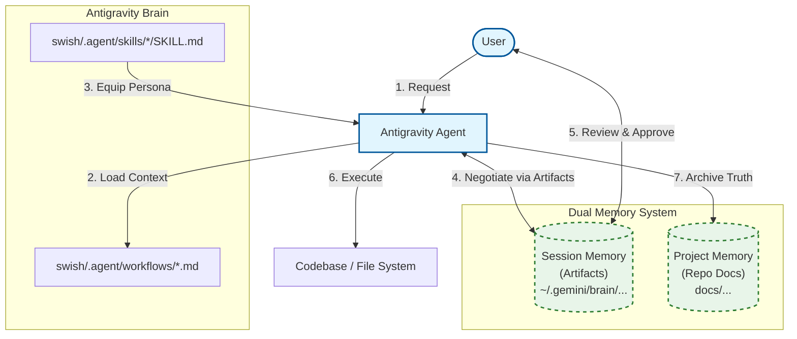

# Project Architecture

This diagram visualizes how the **Claude Code Workflows** project has been adapted to run natively within **Google Antigravity**.

## How it Works

1.  **Trigger**: The user invokes a workflow (e.g., "Run the implement workflow").
2.  **Orchestration**: The agent reads the corresponding markdown file in `.agent/workflows/`.
3.  **Specialization**: The workflow instructs the agent to adopt a specific skill (e.g., `task-executor`).
4.  **Execution**: The agent, now acting as the expert persona, modifies the filesystem to complete the task.
